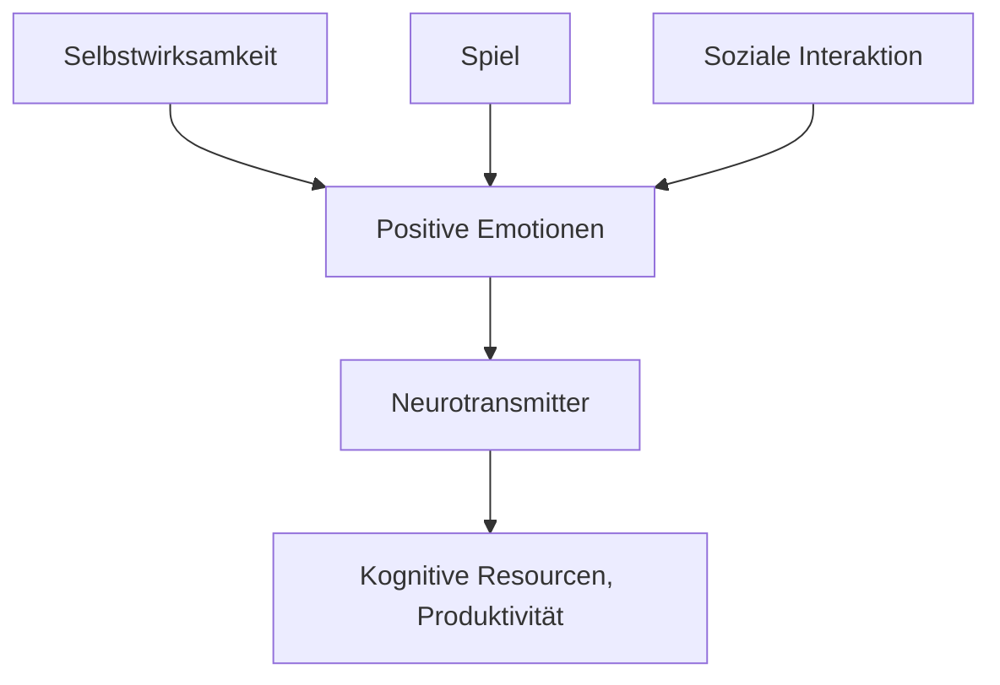

#feegoodprod #public

Beim Energie tanken geht es darum, sich einen möglichst großen Input an positiver Energie zu verschaffen. Letztlich kann man bei "positiver Energie" von einer Menge Neurotransmittern reden (siehe [[Neurotransmitter für positive Emotionen]]), die in der Lage sind, die Produktivität und auch die effektive [[Kognitive Resourcen]] zu steigern. Ausgeschüttet werden diese Neurotransmitter bei positiven Emotionen (siehe [[positive Emotionen]]).

Um die positive Energie aufzubauen gibt es Herangehensweisen, die hierfür herangezogen werden können. 
- [[Energie Tanken durch Selbstwirksamkeit]]
- [[Energie Tanken durch Spiel]]
- [[Energie Tanken durch Soziale Interaktion]]




### Related Links
Quelle: [[book - Ali Abdaal - Feel Good Productivity]] 

### Backlinks
```dataview 
list from [[#]] where contains(file.outlinks, this.file.link)
```

