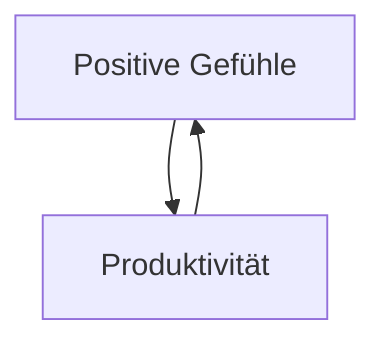

#feegoodprod #public
## Kernaussage
Erfolg muss nicht auf grimmiger selbstzerstörerischen Antriebsquellen wie Stress oder Disziplin aufbauen. Erfolg ist nachhaltiger, wenn er sich an das eigene Wohlbefinden, und an den Dingen die einen wirklich interessieren, gekoppelt ist. Um diese Kopplung zu schaffen gibt es verschiedene Methoden, die im folgenden beschrieben sind. 

## Hypothese - Warum ist die Feel Good Productivity erfolgsversprechend
Bei der Feel Good Productivity wird versucht, mit positiven Gefühle (siehe [[positive Emotionen]]) die Produktivität zu erhöhen. Es wird angenommen, dass Produktivität wiederum positive Emotionen erzeugt und dass sich hieraus ein sich selbst verstärkender Kreislauf ergibt (Siehe: [[selbstverstärkende Zyklen]]), wodurch das gesamte Leben verbessert wird. 




## Methodik
Die Methodik der Feel Good Productivity umfasst die folgenden Kernelemente.
 - [[Energie Tanken]]
 - [[Prokrastination vermeiden]] 
 - [[Kräfte schützen und Burn Out vermeiden]]
Um diese Kernelemente auch in schwierigen Situationen umzusetzen bedarf es Achtsamkeit. Siehe [[Zusammenhang Achtsamkeit und Feel Good Productivity]]


### Related Links
- [[Broaden and Build Theorie]]
- Quelle: [[book - Ali Abdaal - Feel Good Productivity]] 

### Backlinks
```dataview 
list from [[#]] where contains(file.outlinks, this.file.link)
```

