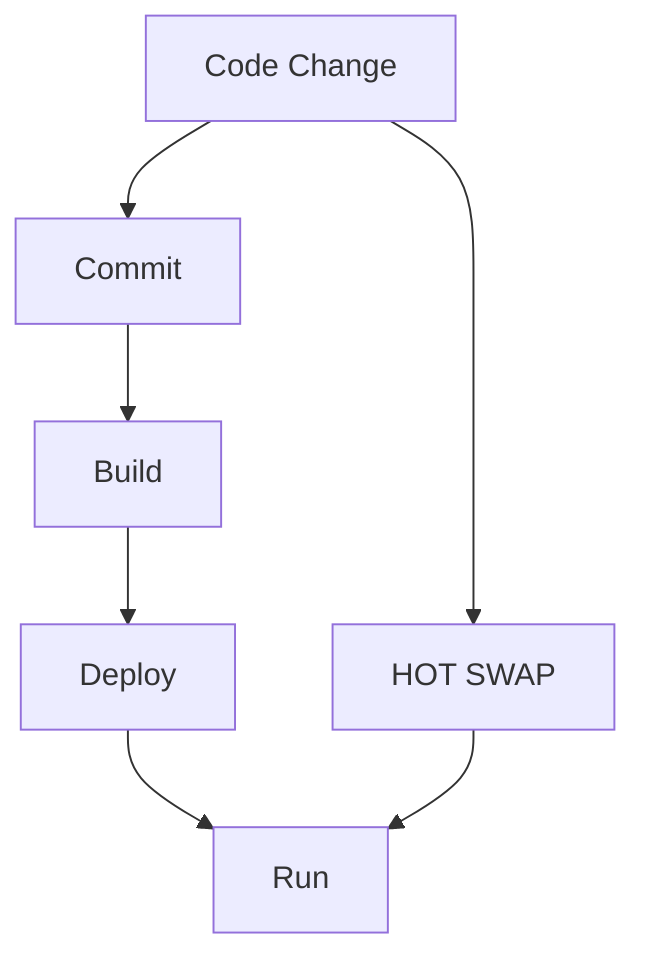

#public

Wow! It is possible to HotSwap changes in a java application, that is already running and deployed on a (local or remote) host. 

So the following use case is given: 
Say you're working on a new feature, committed your changes and pushed them. You started a test deployment in a remote environment and you found a bug caused by your new code. Then you can connect IntelliJ with your running application and start a debug session. Now with the debug session, you can make changes to the code and make a "Hot Swap" this will inject the new bytecode to the running application, which allows you to see your changes on the fly. 





### Related links
- [[docu - jetbrains - alter execution flow]]

### Backlinks
```dataview 
list from [[#]] where contains(file.outlinks, this.file.link)
```

