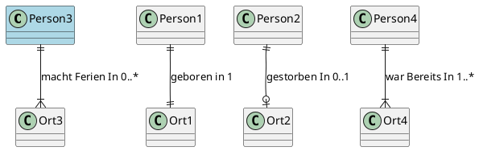

#public
```
@startuml

' Genau Eine Person ist in genau einem Ort geboren (1,1)
Person1 ||--|| Ort1 : geboren in 1

' Genau Eine Person ist in null oder einem Ort gestorben (0,1)
Person2 ||--o| Ort2 : gestorben In 0..1

' Genau Eine Person macht Ferien in null bis vielen Orten (0,N)
Person3 ||--|{ Ort3 : macht Ferien In 0..*

' Eine Person war bereits in mindestens einem bis vielen Orten (1,N)
Person4 ||--|{ Ort4 : war Bereits In 1..*

@enduml
```





### Backlinks
```dataview 
list from [[#]] where contains(file.outlinks, this.file.link)
```

