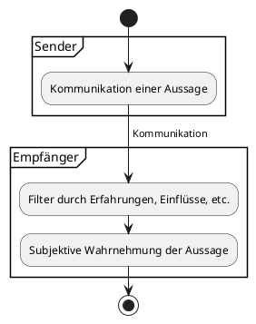
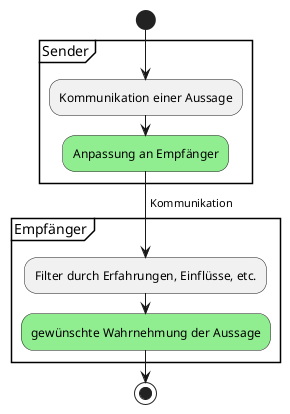

#public 
### Annahme
Kommunikation ist nie Objektiv. Alles was man sagt wird beim Empfänger erst mal gefiltert durch dessen **eigene Erfahrungen, persönliche Werte, Einflüsse und Prinzipien**. Was im Endeffekt wirklich beim Empfänger ankommt ist nur das, was überhaupt bei ihm ankommen kann. Wie diese Filter beim Empfänger ausgeprägt sind, und wie sie arbeiten ist vom Empfänger nicht beeinflussbar.




### Mögliche Einflussnahme auf Qualität der  Kommunikation 
Eine Kommunikation ist dann gut, wenn das Gemeinte (beim Sender) möglichst dem Verstandenen (beim Empfänger) ähnelt. Wie in der Annahme beschrieben, sind es die Filter (also Erfahrungen, Werte, Prinzipien, etc.), die dazu führen, dass das Kommunizierte verändert wird. Auf diese Filter hat man als Sender keinen Einfluss.
Worauf man allerdings schon Einfluss hat, ist WIE kommuniziert wird. Mit genügend Einfühlungsvermögen und Verständnis für den Empfänger ist es möglich, das Kommunizierte derart zu verpacken, dass es in gewünschter Form (durch die Filter) beim Empfänger ankommt



### Backlinks
```dataview 
list from [[#]] where contains(file.outlinks, this.file.link)
```

