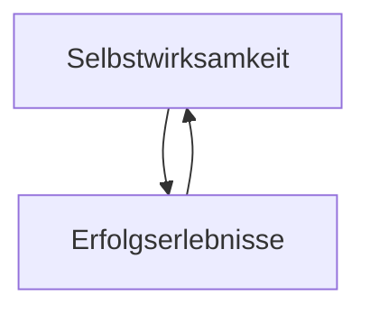

#public

[[Selbstwirksamkeit]] begünstigt, dass man kreativer Denkt und besser kommuniziert. Das wiederum führt dazu, dass [[Erfolgserlebisse]] eintreten. Diese fördern wiederum die Selbstwirksamkeit **(Rückkopplung)**.




### Backlinks
```dataview 
list from [[#]] where contains(file.outlinks, this.file.link)
```

