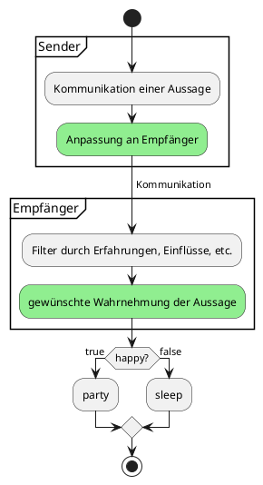

#public



```plantuml
@startuml 
start 
partition Sender { 
	:Kommunikation einer Aussage; 
	#lightgreen :Anpassung an Empfänger;
} 
-> Kommunikation;
partition Empfänger { 
	:Filter durch Erfahrungen, Einflüsse, etc.; 
	#lightgreen :gewünschte Wahrnehmung der Aussage; 
} 

if (happy?) then (true)
	:party;
else (false)
	:sleep;
endif
stop 
@enduml
```


### Backlinks
```dataview 
list from [[#]] where contains(file.outlinks, this.file.link)
```

