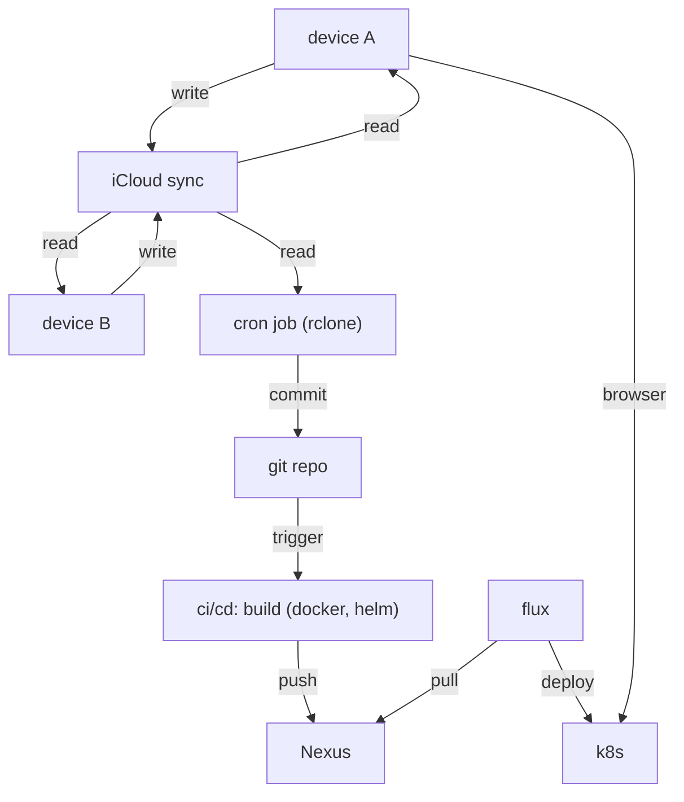

#public

My public Zettelkasten notes from [[My Zettelkasten]] are going to be hosted as static website in my homelab (see [[My homelab]]) with quartz. And maybe on some public domain, as well. But we'll see

Domain: http://digital-garden.homelab.lan
Repository: http://git.pwlab.dev/homelab/digital-garden

#### Features
This setup fulfills the following requirements:
- I can write all my notes in Obsisian without any restrictions
- My work is synced over multiple devices (iOS, Linux, MacOS)
- Everything is automatically version controlled via git
- individual notes can be declared as either public or private
- every commit is tested in a CI/CD pipe
- the pipe builds a static quartz app as docker image and publishes it in my private nexus
- Flux CD automatically deploys every new release in my private k8s





#### Content creation
The content is the set of markdown files, that I write with Obsidian in form of a Zettelkasten. 
#### Cloud Sync for Obsidian
I use Obsidian on multiple devices with different operating systems: iOS, Linux and MacOS. These devices need to be in sync. Obsidian supports sync via iCloud and Obsidian cloud. I read that Obsidian cloud is annoyingly slow. So iCloud should be the better backend. 
To also support Obsidian on my Linux machine I use rclone, which is integrated with iCloud (since [v1.69.0](https://rclone.org/changelog/#v1-69-0-2025-01-12)) and allows bidirectional sync. 

#### Version control
The content is automatically versioned with git. For details see [[digital garden iCloud sync to git]]. There is a main repo, that comprises all of my notes [[repo - zettelkasten private]], and a submodule repo, that comprises the public notes [[repo - zettelkasten public]]. This way I have all my notes - the public and the private ones - in a single Obsidian vault. 

#### Static website generation
To publish my public notes, I use quartz (see [[quartz - static websites with markdown]]). Therefore I forked the original quartz repo to [[repo - digital garden]]. The repo uses the public notes as submodule.

#### Docker image build
The docker image is built in the ci pipeline. 


### Backlinks
```dataview 
list from [[#]] where contains(file.outlinks, this.file.link)
```

