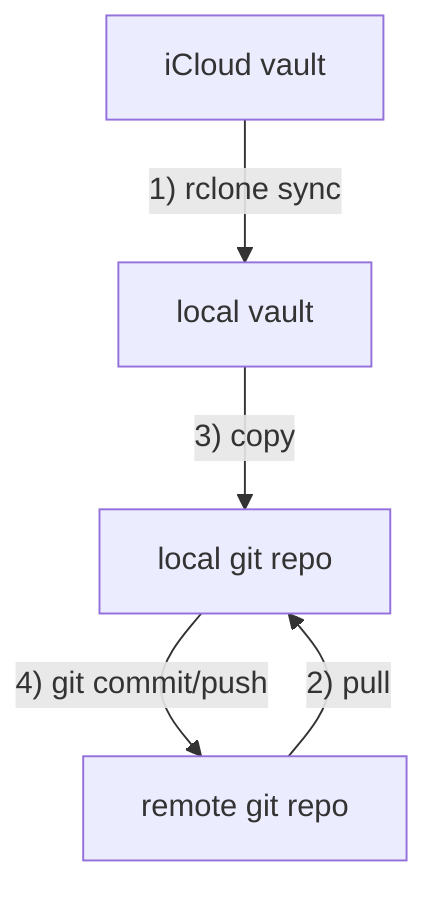

#public


# zettelkasten-sync

This is a tool that keeps the git repository for my Zettelkasten in sync with the current state in the iCloud. 
### Requirements 
- the procedure is containerized with a docker container
- the container must have rclone and git preinstalled
- The procedure pulls the current git repo
- All (temp) data is stored inside the container (can be stored to PV in the future) 
- Uses rclone to fetch the current state from the icloud (different folder than repo)
- Copies the fetched data from icloud to the git repo (inside the container)
- Uses git to commit the changes
- all credentials are provided as env vars to the container
- There is a .env file where all env vars are declared. 
- There is a file .env_template where the variables are declared, but not set
- .env is set to gitignore
- there is a script, that builds the docker image
- there is a script, that builds the helm chart. 

#### Information provided via env vars in .env
- icloud credentials
- git credentials
- git repo



### Backlinks
```dataview 
list from [[#]] where contains(file.outlinks, this.file.link)
```